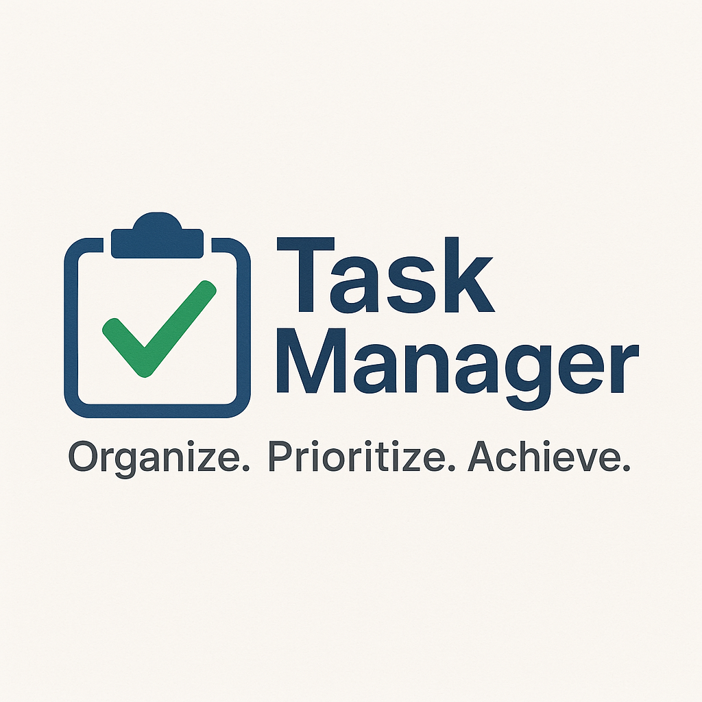

  

# <h1 align="center">Task-Manager</h1> 

Key Features:  
- Authentication (User login & registration)
- CRUD tasks (Create, edit, delete)   
- Set task priority (High/Medium/Low)  
- Set task deadlines  
- Highlight overdue tasks  
- Daily task reminder via email  
- Task filtering by date/priority/read/unread
- Task search by keyword  
- Responsive UI (HTML, CSS, JS)  
- Task completion checkbox  
- Task progress tracking bar  
- Archive completed tasks  
- Add notes or descriptions to tasks  
- Dashboard with today’s tasks summary  
- Custom theme (light/dark mode)

Technology:
-HTML,CSS,JS
-Python, Django

# Credits

Built with using Django by **Md Rakibul Hassan**, **Md Shafin Ahmed Hredoy** and **Md. Tahsin Azad Shaikat**

🔗 [LinkedIn](https://www.linkedin.com/in/md-rakibul-hassan-507b00308)

🔗 [LinkedIn](https://www.linkedin.com/in/iamshafin121?utm_source=share&utm_campaign=share_via&utm_content=profile&utm_medium=android_app)

🔗 [LinkedIn](https://www.linkedin.com/in/mdtahsinazad020?utm_source=share&utm_campaign=share_via&utm_content=profile&utm_medium=android_app)

Designed to help users manage daily responsibilities efficiently through customizable task tracking, real-time progress visualization, smart filtering, reminders, and a responsive, user-friendly dashboard.

# License

This project is open source and available under the MIT License.
