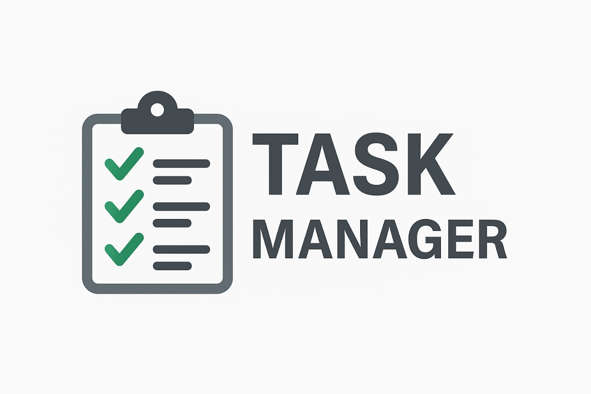

  

<h1 align="center">Task Manager</h1>  

  A simple and efficient task management web app built using <b>Django</b> for backend and <b>HTML, CSS, JavaScript</b> for frontend.  

---

## Key Features  

* **Authentication** – Secure login & user registration.  
* **CRUD Tasks** – Create, edit, update, delete tasks.  
* **Task Priority** – Mark tasks as High/Medium/Low.  
* **Task Deadlines** – Set due dates for tasks.  
* **Overdue Highlighting** – Auto-highlight missed deadlines.  
* **Email Reminders** – Daily pending task notifications.  
* **Task Filtering** – Sort by date, priority, status.  
* **Task Search** – Find tasks using keywords.  
* **Responsive UI** – Works on all screen sizes.  
* **Completion Checkbox** – Mark tasks as completed.  
* **Progress Tracking Bar** – Visualize daily task progress.  
* **Archive Tasks** – Store completed tasks separately.  
* **Notes/Descriptions** – Add details to each task.  
* **Dashboard Summary** – Shows today’s tasks overview.  
* **Custom Themes** – Light & dark mode options.  

---

## Tech Stack  

- **Frontend:** HTML, CSS, JavaScript  
- **Backend:** Python, Django  
- **Database:** SQLite (default) / PostgreSQL  
- **Other Features:** Email Notifications, Responsive UI  

---

## Features Overview  

This Task Manager app helps users manage daily responsibilities efficiently with:  
- **Customizable task tracking** for better organization  
- **Real-time progress visualization** to track daily goals  
- **Smart filtering & search** for easy task navigation  
- **Email reminders** to never miss deadlines  
- **Clean dashboard & themes** for better user experience  

---

## Screenshots  

---

## Developers  

Built by:  
- [Md Rakibul Hassan](https://www.linkedin.com/in/md-rakibul-hassan-507b00308)  
- [Md Shafin Ahmed Hredoy](https://www.linkedin.com/in/iamshafin121?utm_source=share&utm_campaign=share_via&utm_content=profile&utm_medium=android_app)  
- [Md. Tahsin Azad Shaikat](https://www.linkedin.com/in/mdtahsinazad020?utm_source=share&utm_campaign=share_via&utm_content=profile&utm_medium=android_app)  

---

## License  

This project is **open-source** and available under the **MIT License**.  

---

### ⭐ If you like this project, don’t forget to star the repo!  
